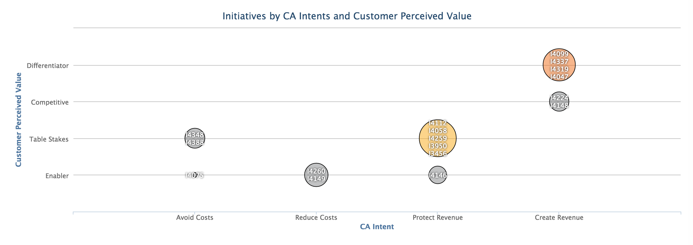

intentvalue
=========================

## Overview

A CA Agile Central app that looks at two custom fields for CA initiatives, "CA Intent" and "Customer Perceived Value", and maps them as a bubble chart. The app looks at plan estimates for all stories and defects in a release and aggregates them into initiatives accordingly.